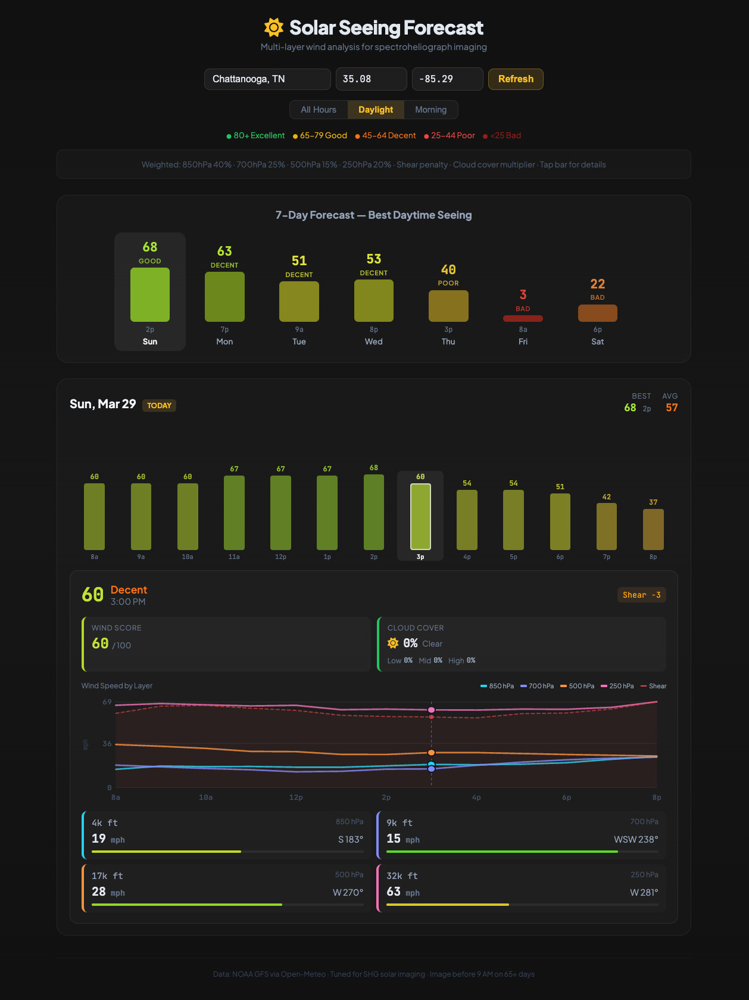

# ☀️ Solar Seeing Forecast

**[solarseeing.com](https://solarseeing.com)**

A free, open-source solar seeing forecast tool for spectroheliograph and solar telescope imaging. Analyzes multi-layer atmospheric wind and boundary layer thermal data to predict seeing conditions up to 7 days out.

## Why This Exists

Standard astronomical seeing forecasts (Clear Sky Chart, Astrospheric, Meteoblue) are designed for nighttime observing and don't reliably predict daytime seeing conditions. Daytime solar seeing is dominated by ground-layer convection — not the upper-atmosphere turbulence that nighttime tools model.

This tool analyzes wind speed and direction at four atmospheric pressure levels, adds a boundary layer thermal component derived from sensible heat flux and planetary boundary layer height, and produces an hourly seeing quality forecast tuned specifically for solar imaging.

## How It Works

### Multi-Layer Wind Analysis

The tool pulls GFS forecast data from the [Open-Meteo API](https://open-meteo.com/) at four pressure levels:

| Layer | Altitude | Weight | Why It Matters |
|-------|----------|--------|----------------|
| 850 hPa | ~4k ft | 40% | Ground layer — dominates daytime seeing. 55-65% of optical turbulence lives below 500m (Big Bear, La Palma studies) |
| 700 hPa | ~9k ft | 25% | Summit-adjacent — strong predictor per Mauna Kea Weather Center ML models |
| 500 hPa | ~17k ft | 15% | Mid-troposphere — weaker individual predictor, falls in turbulence "gap" |
| 250 hPa | ~32k ft | 20% | Jet stream — Vernin (1986) 20 m/s threshold for sub-arcsecond seeing |

### Boundary Layer Thermal Penalty

In addition to wind, the tool applies a thermal penalty derived from two surface variables that directly drive daytime optical turbulence in the boundary layer:

**Sensible heat flux (SHF)** is the primary thermal driver. Via Monin-Obukhov similarity theory, Cn² scales with H^(2/3), where H is the surface sensible heat flux. High SHF means the ground is actively pumping heat into the boundary layer, generating convective turbulence. In correlation analysis against a full year of Solar Scintillation Monitor (SSM) data at St Véran Observatory (n=292 morning hours), SHF achieved r=+0.667 vs measured seeing — stronger than any individual wind layer.

**Planetary boundary layer height (PBL)** is the secondary thermal driver. A deeper convective column means more integrated Cn² overhead. PBL height under 500m (typical at dawn) contributes no penalty; a fully developed summer convective boundary layer exceeding 3.5 km contributes up to 28 points of penalty.

Latent heat flux was evaluated but excluded — empirical correlation analysis showed it dilutes the combined SHF+PBL signal (r drops from 0.686 to 0.636 when added).

The thermal penalty is subtracted from the wind score before the cloud multiplier is applied, with a maximum cap of 50 points:

| SHF (W/m²) | Penalty | Typical Timing |
|------------|---------|----------------|
| ≤ 0 | 0 pts | Night / stable |
| < 50 | 3 pts | Early morning |
| < 150 | 12 pts | Mid-morning |
| < 300 | 22 pts | Late morning |
| < 500 | 32 pts | Midday summer |
| 500+ | 40 pts | Peak convection |

| PBL Height | Penalty |
|------------|---------|
| < 500 m | 0 pts |
| < 1000 m | 3 pts |
| < 1500 m | 8 pts |
| < 2500 m | 15 pts |
| < 3500 m | 22 pts |
| 3500 m+ | 28 pts |

### Scoring Model

Each layer's wind speed is scored independently using thresholds derived from observatory research:

- **850 hPa uses a U-shaped curve** — stagnant air (< 2 m/s) is penalized because thermal plumes build without mixing. The sweet spot is 2-5 m/s.
- **250 hPa is anchored on Vernin's 20 m/s threshold** — the most robust finding in the literature for sub-arcsecond free-atmosphere seeing.
- **Vector wind shear penalty** — computed between adjacent layer pairs. Optical turbulence (Cn²) scales with shear squared, so large speed or direction differences between layers are penalized.
- **Cloud cover multiplier** — tuned for solar imaging where you only need a 2-minute clear window. Partly cloudy conditions (30-50%) barely affect the score since gaps are plentiful.

### Score Scale

| Score | Rating | What It Means |
|-------|--------|---------------|
| 80+ | Excellent | Sub-arcsecond conditions possible. High-resolution day. |
| 65-79 | Good | Great for full-disk SHG work. Fine detail visible. |
| 45-64 | Decent | Workable — spectroheliograph seeing resistance helps. |
| 25-44 | Poor | Expect choppy reconstructions. Coarse detail only. |
| < 25 | Bad | Jet stream overhead or heavy overcast. Skip it. |

## Limitations

This tool forecasts free-atmosphere and boundary layer wind conditions using GFS model data. It cannot account for hyperlocal effects that significantly impact daytime seeing, including ground-level thermal plumes from nearby surfaces (concrete, rooftops, asphalt), local humidity and dew point conditions, telescope tube currents, or site-specific terrain effects. These factors can easily add 1-2 arcseconds of degradation regardless of what the upper atmosphere is doing. The best scores in this tool should be read as "the atmosphere is cooperating" rather than "you will get great images." Good site selection and early morning timing are still essential.

## Features

- **7-day forecast** with best score per day at a glance
- **Hourly bar chart** for each day — tap any bar for details
- **Multi-layer wind speed chart** — see all four layers plotted across the day with shear overlay
- **Thermal panel** — sensible heat flux (W/m²), PBL height (m), and thermal penalty breakdown
- **Cloud cover integration** — cloud icons on bars, detailed breakdown in panel
- **Wind shear visualization** — dashed red line showing total vector shear
- **Time filters** — All Hours / Daylight / Morning (sunrise-based)
- **Any location** — enter coordinates for anywhere in the world
- **Click-interactive** — bar chart and wind chart both respond to clicks
- **Zero infrastructure** — runs entirely client-side, no backend needed

## Calibration Sources

The scoring model draws from:

- **Vernin (1986)** — foundational 20 m/s jet stream threshold
- **Sarazin & Tokovinin (2002)** — V₀ = max(V_ground, 0.4 × V₂₀₀) empirical formula used at ESO Paranal
- **Cherubini et al. (2022)** — Mauna Kea Weather Center ML seeing forecast, GFS at 650-200 mb
- **Andreas, E. L. (1988)** — "Estimating Cn² over snow and sea ice from meteorological data," JOSA-A 5(4). Establishes Cn² ∝ H^(2/3) via Monin-Obukhov similarity theory; foundational basis for the SHF penalty term
- **Quatresooz, F., Vanhoenacker-Janvier, D., & Oestges, C. (2023)** — "Daytime forecast of optical turbulence for optical communications," COAT2023. Hybrid Cn² profile model separating boundary layer (SHF + PBL height via Monin-Obukhov) from free atmosphere (Tatarskii + HMNSP99 outer scale); directly informs the thermal penalty structure
- **Montoya, L. et al. (2017)** — "Modeling day time turbulence profiles: application to Teide Observatory," AO4ELT5. SCIDAR-validated comparison of Coulman, Dewan, Masciadri, Thorpe, and Trinquet Cn² models at Tenerife; confirms free atmosphere is stationary between day and night, supports hybrid boundary layer approach
- **Shikhovtsev, A. Y. et al. (2023)** — "Simulating atmospheric characteristics and daytime astronomical seeing using Weather Research and Forecasting Model," *Applied Sciences* 13(10), 6354. WRF-based daytime seeing at Baikal Astrophysical Observatory; validates Dewan outer-scale model and demonstrates site-specific calibration requirement; WRF-modeled seeing vs Shack-Hartmann measurements
- **Big Bear Solar Observatory** — daytime Cn² profiles showing 55-65% of turbulence below 500m
- **Swedish Solar Telescope, La Palma** — 67% of daytime turbulence in 0-500m layer
- **Cloudy Nights / SolarChat forums** — community experience with jet stream thresholds, site selection, and daytime seeing patterns

## Validation

The scoring model has been tested against Solar Scintillation Monitor (SSM) data from two sites with very different characteristics. The dataset is limited and actively growing — if you have an SSM and are willing to share session logs, please open an issue or get in touch.

All correlations below are reported as r vs seeing quality (higher score = better predicted seeing, higher r = stronger agreement).

### St Véran Observatory, France (2930m altitude)

One year of SSM data (Mar 2025–Mar 2026, n=1,826 daytime hours) provides the largest single validation dataset. Key findings from morning hours (06-09 UTC, n=292):

| Variable | r vs seeing quality |
|----------|---------------------|
| Composite score (wind + thermals) | +0.185 |
| Wind score alone | +0.026 |
| Thermal penalty contribution | +0.639 |

Correlation is moderate and consistent with published WRF-based Cn² forecast results — Quatresooz et al. achieved r≈0.53–0.56 at Tenerife using a full mesoscale model. The important caveat is that St Véran at 2930m sits above much of the planetary boundary layer, making it unrepresentative of most backyard sites. At altitude, the thermal terms are the dominant predictors; wind alone contributes very little.

### Gold Coast, Queensland, Australia (sea level)

Nine SSM sessions (Jan–Mar 2026, n=71 readings) provide the only low-altitude validation data. This site is subtropical, coastal, and effectively at sea level — far more representative of typical backyard observers.

| Filter | n | Composite score r | Wind-only r |
|--------|---|-------------------|-------------|
| All hours | 71 | +0.455 | +0.382 |
| Early morning only (AEST 07–09) | 48 | +0.496 | +0.149 |
| Late morning (AEST 10–12) | 23 | +0.330 | +0.323 |

At sea level the composite score performs substantially better than at the mountain site. The thermal terms contribute most in the early morning window — wind alone gives r=+0.149 before thermals develop, rising to r=+0.496 with the thermal penalty included. By late morning, once SHF exceeds ~400 W/m², the thermal penalty saturates and wind and composite scores converge. The early morning window (within ~4 hours of sunrise) consistently produces the strongest predictions at both sites.

The Gold Coast dataset is small and the highest priority for the model is additional low-altitude SSM data from backyard sites worldwide.

## Tech Stack

- Single static HTML file
- React 18 via CDN
- Babel standalone for JSX transpilation
- Font Awesome 6 icons
- Plus Jakarta Sans + JetBrains Mono fonts
- Open-Meteo GFS API (free, no key required)
- Hosted on Cloudflare Pages

## Development

No build tools needed. Edit `index.html` and push:

```bash
git clone https://github.com/uotw/solarseeing.git
cd solarseeing
# edit index.html
git add .
git commit -m "your changes"
git push
```

Cloudflare Pages auto-deploys on push to `main`.

### Local Development

Just open `index.html` in a browser. The API calls work from `file://` — no local server needed.

## Contributing

This is a first-version scoring model that needs real-world validation. Contributions welcome:

- **Imaging session reports** — compare the forecast score to your actual seeing conditions
- **SSM data correlation** — if you have a Solar Scintillation Monitor, comparing readings to predictions would be invaluable
- **Scoring threshold refinements** — adjust the wind speed breakpoints based on empirical data
- **Low-altitude validation** — the current SSM dataset is from a 2930m mountain site; backyard-level data (200-500m) would be far more representative for most users
- **UI improvements** — mobile optimization, accessibility, additional visualizations



## License

MIT

## Acknowledgments

Built with data from [Open-Meteo](https://open-meteo.com/) and informed by decades of community knowledge from [Cloudy Nights](https://www.cloudynights.com/), [SolarChat](https://solarchatforum.com/), and the professional observatory seeing research community.

Scoring model research, correlation analysis, and code were developed with the assistance of [Claude](https://claude.ai) (Anthropic).
